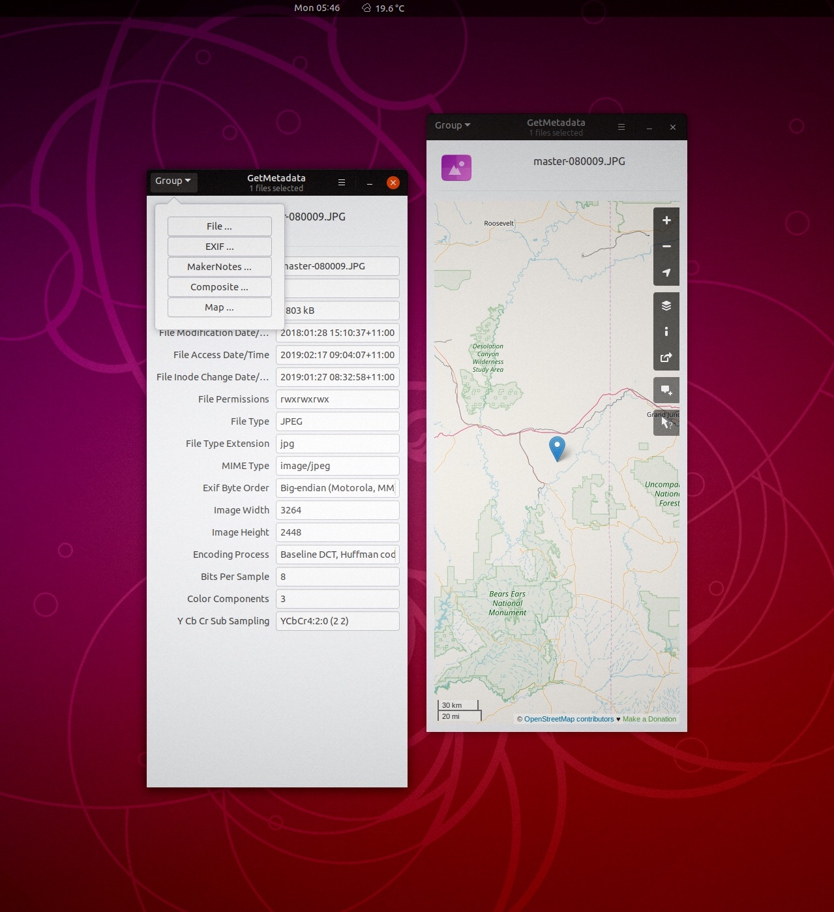

# Nautilus-Metadata

<<<<<<< HEAD
Nautilus-Metadata is a GNOME nautilus script written in javascript using the C
Bindings of GJS. It's basically a GUI wrapper of the excellent exif metadata extraction
tool Exiftool, written by Phil Harvey.
=======

>>>>>>> f681f3dc79900382e888277227f2bad6993a62c4
